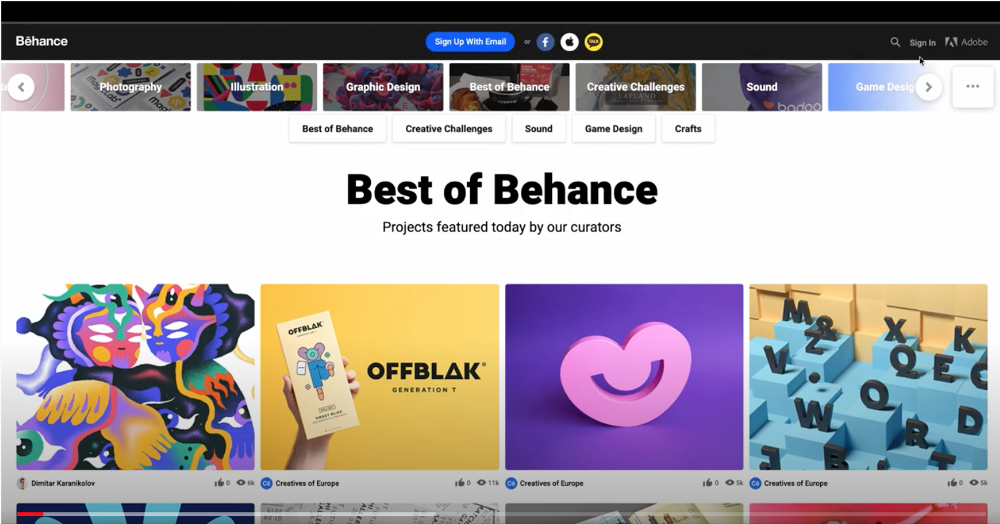
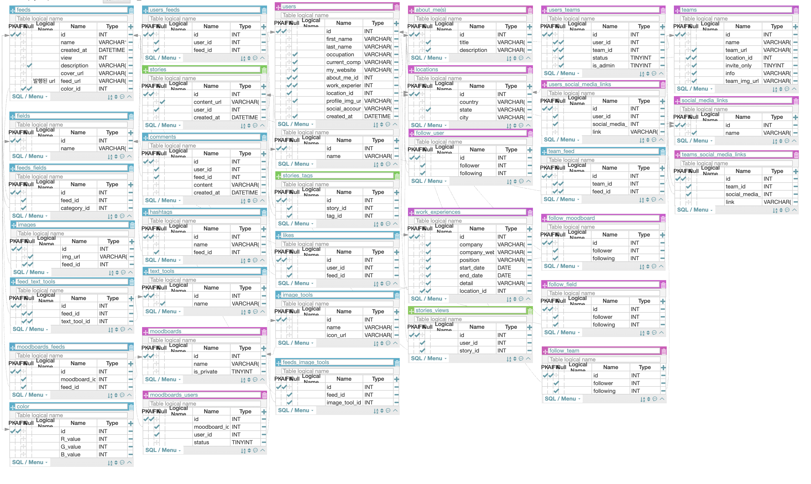

# Overview _ Backend
This project is to clone Behance website, which is a social network platform of creative works in just about every field for career-oriented designers. It is basically a place for promoting portfolio to connect and inspire. By showcasing creative works, anyone can network with peers by following and getting artistic feedbacks.

 

## Duration and Contributors
- duration: 12days(June 8th ~ June 19th)
- Back-end members : [HyerangKim](https://github.com/RainaKim), [KwangMook Jung](https://github.com/teddy-jung)

 

## Demo Video

 

## Objectives
- Analyze the website structure and create a relational database
- Crawl the already uploaded projects and user information from the website
- Insert data crawled into the database created based on the modeling
- Using Social media API to sign up and sign in with a social auth
- Create APIs
- Integrate APIs in front-end

 

## Applied tech stacks and Implementations

### Applied tech stacks
- Python/Django web framework
- Selenium
- BeautifulSoup
- Bcrypt/JWT
- Json
- CORS Headers
- MySQL
- Docker
- AWS S3
- boto3

 

### Database ERD Modeling

### Implementations

#### User
- Authorization/Authentication via social media signin API
- Created login_decorator for user verification
- Implemented login required user profile and viewing others' profiles
- Follow, unfollow, and follow lists of users
- Like, unlike, and like lists of feeds

#### Feed
- All projects list/filtered by user preference/filtered by categories
- Feed details with recommended other projects created by the owner just viewed
- Feeds uploading with multiple images by generating urls via AWS S3 buckets

 

## API Reference
[Behance Clone Project APIs]

